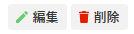
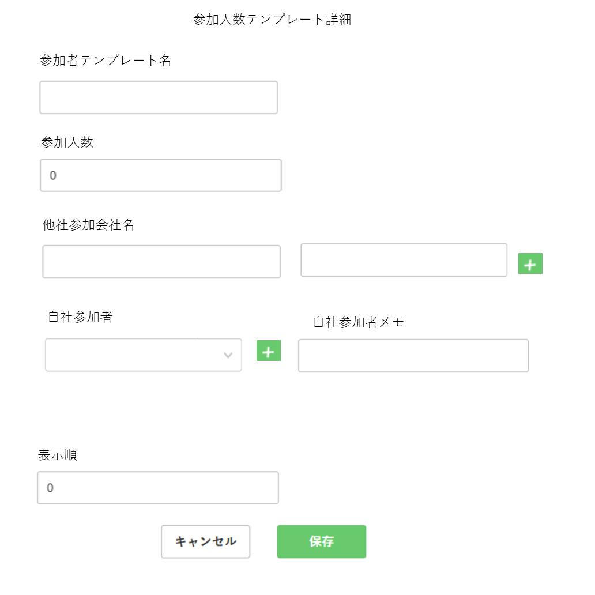
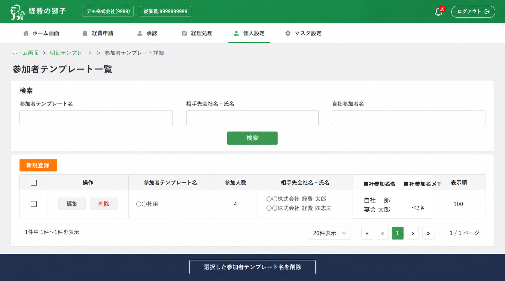

> ⚠️ **File này được auto-generate từ sheet spec — KHÔNG sửa tay.**
>
> - Nếu có câu trả lời/làm rõ từ PO/BA → ghi vào [`clarifications.md`](./clarifications.md).
> - Nếu spec gốc (xlsx) được update → regenerate file này bằng Claude Code, không edit thủ công.
> - Mọi thay đổi version phải được ghi vào [`CHANGELOG.md`](./CHANGELOG.md).
> - File chốt để dev implement là `final_spec.md` (sẽ tạo sau khi PO trả lời xong clarifications).

---

# Phân tích Spec — Màn hình "Template người tham gia" (参加者テンプレート)

> **Sheet nguồn**: `Detail template nguoi tham gia`
> **File spec**: `ApplicationRulesAndMeetingExpenses_20260226_VN.xlsx`
> **Ngày phân tích**: 2026-05-28
> **Phạm vi**: Tài liệu này CHỈ phân tích nội dung sheet `Detail template nguoi tham gia`. Các sheet khác (Setting detail mục chi phí, modal, Setting detail shinsei form…) chỉ được tham chiếu khi spec sheet này nhắc tới — không suy đoán nội dung.

---

## 1. Tổng quan màn hình

Spec mô tả **hai màn hình** liên quan đến chức năng "Template người tham gia" (参加者テンプレート — Participant Template):

| # | Tên màn hình | Mục đích |
|---|---|---|
| 1 | 参加者テンプレート一覧画面 (List màn hình) | Danh sách các template người tham gia đã đăng ký — search, tạo mới, edit, xoá |
| 2 | 参加人数テンプレート詳細画面 (Detail/Modal) | Form tạo mới / chỉnh sửa một template người tham gia |

**Vai trò trong flow tổng**:
- Là một loại "master / template" thuộc cụm tính năng **"Application Rules and Meeting Expenses"** (quy tắc đơn xin và chi phí giao tế).
- Template chứa sẵn thông tin về một nhóm người tham gia (vd: "Template dùng cho công ty XX") để khi nhân viên lập đơn chi phí giao tế (会議費 / 接待費) có thể chọn nhanh thay vì nhập tay từng người.
- Theo breadcrumb trong screenshot list (`ホーム画面 > 申請テンプレート一覧 > 参加者テンプレート詳細`), màn hình được truy cập qua menu **マスタ設定** (Master Settings).
- Liên kết nghiệp vụ: có ràng buộc với "Setting detail mục chi phí" (cài đặt loại chi phí) — xem **mục 4.2** bên dưới.

---

## 2. Danh sách field / component

### 2.1 Màn hình List — 参加者テンプレート一覧

**Khu vực Search (phía trên)**

| # | Field | Tiếng Nhật | Kiểu | Ghi chú |
|---|---|---|---|---|
| S1 | Tên template | 参加者テンプレート名 | Text input | Filter theo tên |
| S2 | Tên công ty / họ tên người tham gia bên ngoài | 相手先会社名・氏名 | Text input | Filter |
| S3 | Tên người tham gia thuộc công ty mình | 自社参加者名 | Text input | Filter |
| — | Nút 検索 (Search) | — | Button | Submit search |

**Khu vực Table (cột)**

| # | Cột | Tiếng Nhật | Mô tả (lấy từ row C3:H3 — chú thích VN) |
|---|---|---|---|
| 1 | Checkbox | □ | Chọn nhiều dòng để xoá hàng loạt |
| 2 | 操作 (Action) | — | Chứa nút **編集** (Edit) và **削除** (Delete) cho từng dòng (xem image_B5.png) |
| 3 | 参加者テンプレート名 | Tên template đang được áp dụng | Vd: `○○社用` |
| 4 | 参加人数 | Số người tham gia | Vd: `4` |
| 5 | 相手先会社名・氏名 | Tên công ty + tên người tham gia bên ngoài | Multi-line, vd: `HBLAB株式会社 経費 太郎` / `HBLAB株式会社 経費 四志夫` |
| 6 | 自社参加者名 | Tên người tham gia thuộc công ty mình | Multi-line, vd: `自社 一郎` / `宴会 太郎` |
| 7 | 自社参加者メモ | Memo người tham gia thuộc công ty mình | Vd: `他2名` (còn 2 người nữa) |
| 8 | 表示順 | Số thứ tự hiển thị | Vd: `100` |

**Footer / Action button**
- `新規登録` — nút tạo mới (mở Detail modal/screen).
- `選択した参加テンプレートを削除` — xoá nhiều dòng được tick.
- Phân trang: hiển thị `1件中 1~1件`, page size `20件表示` (theo screenshot).

### 2.2 Màn hình Detail — 参加人数テンプレート詳細

> **Lưu ý naming**: Title của list dùng "**参加者**テンプレート" còn title của detail dùng "**参加人数**テンプレート". Đây có vẻ là điểm không nhất quán trong spec — **cần làm rõ** (xem mục 6).

| # | Field | Tiếng Nhật | Kiểu UI | Validation / Rule | Required | Default |
|---|---|---|---|---|---|---|
| F1 | Tên template | 参加者テンプレート名 | Text input | (Spec không nêu giới hạn ký tự) | — | (trống) |
| F2 | Số người tham gia | 参加人数 | Text input (số) | Nhập **1 ~ 999** | — | **0** *(xem mâu thuẫn ở mục 6)* |
| F3 | Tên công ty của người tham gia bên ngoài | 他社参加会社名 | Text input | **Chỉ nhập khi** trong "Setting detail mục chi phí" có bật tùy chọn hiển thị trường nhập người tham gia bên ngoài (liên quan checkbox ở màn Setting detail mục chi phí) | Tùy setting | (trống) |
| F3b | Tên người tham gia bên ngoài | (không có nhãn JP riêng — đi kèm F3) | Text input | Đi kèm cặp với F3 | Tùy setting | (trống) |
| F4 | Nút cộng (cho cặp F3 + F3b) | + | Button | Thêm một cặp (tên công ty bên ngoài, tên người tham gia bên ngoài). **Tối đa 99 cặp** | — | — |
| F5 | Người tham gia thuộc công ty mình | 自社参加者 | Dropdown (chỉ hiển thị tên nhân viên) | Có thể chọn **mọi nhân viên có quyền hạn khác role 1**. **Không phụ thuộc** vào phòng ban của người tạo đơn. | — | (trống) |
| F6 | Nút cộng (cho F5) | + | Button | Thêm một dropdown chọn người tham gia thuộc công ty mình. **Tối đa 99 dòng** | — | — |
| F7 | Memo người tham gia thuộc công ty mình | 自社参加者メモ | Text input | (Spec không nêu giới hạn) | — | (trống) |
| F8 | Số thứ tự hiển thị | 表示順 | Text input (số) | (Spec không nêu range) | — | **0** |
| — | Nút キャンセル | Cancel | Button | Đóng modal/màn hình, không lưu | — | — |
| — | Nút 保存 | Save | Button | Submit form | — | — |

> Note đánh số trong spec không liên tục: trong sheet xuất hiện `1.`, `2.`, `3`, `4.`, `5.`, `6.` (cho 自社参加者), `6. 自社参加者メモ` (trùng số 6), rồi nhảy `８.` (表示順). Đã ghép lại trong bảng trên theo nội dung; **đánh số trong spec bị lỗi/duplicate** — xem mục 6.

---

## 3. Mô tả UI từ ảnh (3 ảnh đã extract)

### 3.1 image_B5.png — Action buttons trong row của bảng list
**Vị trí nhúng**: cell `B5` của sheet (cột 操作 trong sample row).

Ảnh là một cụm 2 nút inline dùng làm action cho từng row trong bảng list:
- `編集` — nút Edit (viền xám, icon bút chì xanh).
- `削除` — nút Delete (viền xám, icon thùng rác đỏ).

### 3.2 image_A10.png — Mockup màn hình Detail
**Vị trí nhúng**: cell `A10` (gắn cạnh phần mô tả field trong spec).

Đây là **wireframe của màn hình/modal Detail** với layout dọc, các trường được xếp theo thứ tự sau:
1. Title (canh giữa, ở đỉnh): `参加人数テンプレート詳細`
2. `参加者テンプレート名` — 1 text input rộng (~1 cột).
3. `参加人数` — 1 text input nhỏ hơn, placeholder/default = `0`.
4. `他社参加会社名` — **2 text input nằm cùng hàng** (ô tên công ty và ô tên người tham gia bên ngoài), sau ô bên phải là **nút `+` xanh** để thêm cặp mới.
5. `自社参加者` — 1 dropdown (có icon chevron `v`), bên cạnh là **nút `+` xanh** để thêm dòng mới. Cùng hàng còn có cột `自社参加者メモ` — 1 text input.
6. `表示順` — 1 text input nhỏ, default = `0` (placeholder).
7. Footer: **canh giữa**, có 2 nút `キャンセル` (viền trắng) và `保存` (nền xanh).

**Quan sát layout từ ảnh** (không có trong text spec, cần xác nhận):
- 自社参加者 và 自社参加者メモ được render **cùng hàng** (column 2-column layout). Spec text không nói rõ — chỉ liệt kê tuần tự.
- `参加人数` và `表示順` cùng hiển thị placeholder `0` → khớp với note "default 0" trong text.

### 3.3 image_A45.png — Screenshot màn hình List
**Vị trí nhúng**: cell `A45` (cuối sheet, dưới label "Design màn hình").

Đây là **screenshot mockup full-screen** của màn hình list `参加者テンプレート一覧`. Các thành phần nhận diện được:
- **Header dự án**: logo `経費の獅子`, mã công ty `(***株式会社 (00001)`), menu chính: `ホーム画面 / 申請受付 / 承認 / 経理処理 / 個人入設定 / マスタ設定`. Nút `ログアウト` ở góc phải.
- **Breadcrumb**: `ホーム画面 > 申請テンプレート一覧 > 参加者テンプレート詳細`. → Suy ra navigation path đi qua "申請テンプレート一覧" trước, **không** vào trực tiếp từ menu (cần xác nhận, vì breadcrumb ghi "詳細" nhưng nội dung lại là list).
- **Title**: `参加者テンプレート一覧`.
- **Khối Search**: 3 ô input (`参加者テンプレート名`, `相手先会社名・氏名`, `自社参加者名`) + nút `検索` (nền xanh).
- **Nút `新規登録`** (xanh) ở trên bảng.
- **Bảng** với cột: checkbox, 操作 (gồm `編集` + `削除`), 参加者テンプレート名, 参加人数, 相手先会社名・氏名, 自社参加者名, 自社参加者メモ, 表示順.
- **Sample row**: `○○社用` | `4` | `株式会社 経費 太郎 / 株式会社 経費 四志夫` | `自社 一郎 / 宴会 太郎` | `他2名` | `100`.
- **Pagination**: `1件中 1~1件` ở góc dưới trái, `20件表示` + số trang `1` ở giữa-phải.
- **Footer button** dưới bảng (canh giữa): `選択した参加テンプレートを削除` (nền xám đậm).

---

## 4. Business logic / rule rút ra được từ spec

### 4.1 Validation
- `参加人数` (số người tham gia): nhập số nguyên trong khoảng **1–999**, default `0`. **Mâu thuẫn**: default = 0 nhưng range hợp lệ bắt đầu từ 1 → cần xác nhận quy tắc submit (xem mục 6).
- `他社参加会社名` (cặp công ty/người ngoài): **tối đa 99 cặp**.
- `自社参加者`: **tối đa 99 dòng**.
- Cả hai nút `+` cộng đều có giới hạn 99 — khi đạt giới hạn cần disable nút (spec không nói rõ — suy luận hợp lý).

### 4.2 Phụ thuộc với "Setting detail mục chi phí"
- Trường `他社参加会社名` + `他社参加者名` **chỉ hiện** khi trong setting của loại chi phí (mục chi phí) có bật tùy chọn "hiển thị trường nhập người tham gia bên ngoài" (`Liên quan đến phần checkbox ở màn setting detail mục chi phí`).
- → Render của detail form phải đọc state setting để show/hide cặp F3.
- → Khi cài đặt loại chi phí **không** bật, template tạo ra sẽ **không có** thông tin người tham gia bên ngoài.

### 4.3 Quy tắc chọn 自社参加者 (employee dropdown)
- Lấy **toàn bộ nhân viên trong phạm vi hợp lệ** (không bị giới hạn theo phòng ban người tạo đơn).
- **Loại trừ** nhân viên có "**role 1**" (spec ghi: "Có thể chọn tất cả nhân viên có quyền hạn khác role 1").
- → Cần xác định "role 1" ứng với enum nào trong `Roles` (`SUPER_ADMIN`? `EMPLOYEE`?) — xem mục 6.

### 4.4 Hiển thị
- `表示順` (display order): điều khiển thứ tự sắp xếp trong list; default `0`. (Note: convention dự án dùng default `100` cho `hyoji_jun` — xem mục 6).
- Cột `相手先会社名・氏名` trong list hiển thị **multi-line** (mỗi cặp công ty + tên người ngoài trên 1 dòng).
- Cột `自社参加者名` cũng hiển thị multi-line (mỗi tên nhân viên trên 1 dòng).
- Cột `自社参加者メモ` hiển thị 1 dòng memo dạng tổng (vd `他2名` để chỉ "còn 2 người khác chưa liệt kê").

### 4.5 Action
- **Edit per row** (nút 編集): mở Detail trong chế độ chỉnh sửa.
- **Delete per row** (nút 削除): xoá 1 record.
- **Bulk delete** (nút `選択した参加テンプレートを削除`): xoá theo checkbox đã tick.
- **Create new** (nút `新規登録`): mở Detail trong chế độ tạo mới.
- Soft delete: spec không nêu rõ, nhưng theo convention dự án (xem `.claude/rules/database.md`) phải dùng `delete_flag` thay vì hard delete.

---

## 5. Mapping sang convention dự án (tham chiếu nhanh, không phải implement)

> Phần này chỉ liệt kê ra để hỗ trợ planning, **không** code thực tế.

- Bảng dự kiến: master → `tm_sankasha_template` (hoặc tên gần đúng), schema `keihi_com`, có audit fields + `delete_flag` + `update_version` + `hyoji_jun` theo convention.
- Cần ít nhất 2 bảng phụ để lưu list "他社参加" (1-N) và "自社参加者" (1-N) — vì mỗi template có nhiều dòng.
- API tuân theo pattern Hexagonal: `SankaTemplateApi` → `Delegate` → `UseCase` → `Service` → `Crud` adapter → `Repository`.
- Endpoint dự kiến (chuẩn convention): `POST /sanka-template` (add), `PUT /sanka-template/{id}` (update), `DELETE /sanka-template/{id}` (single), `DELETE /sanka-template` (bulk), `POST /sanka-template/search`.

---

## 6. Câu hỏi cần làm rõ

> Các điểm spec **chưa rõ / mâu thuẫn / thiếu** — cần PO/BA xác nhận trước khi code.

### 6.1 Tên màn hình không nhất quán
- List dùng `参加者テンプレート一覧`; detail dùng `参加人数テンプレート詳細`. Hai cách gọi khác nhau ("**参加者**" vs "**参加人数**") — dùng tên nào là chuẩn? Tên class/API/bảng nên dùng `sankasha` (参加者) hay `sankaninzu` (参加人数)?

### 6.2 Default `参加人数 = 0` vs validation `1~999`
- Spec ghi:
  - `Có thể nhập từ 1 đến 999.`
  - `Giá trị Default là 0`
- Nếu default = 0 thì khi submit mà user không sửa thì sẽ fail validation. → Default có nên là `1`? Hay khi submit `0` được tự động hiểu là "không nhập" và bỏ qua validation? Hay validation chỉ kích hoạt khi giá trị ≠ 0?

### 6.3 "Role 1" là role nào?
- Spec: "Có thể chọn tất cả nhân viên có quyền hạn khác **role 1**". Cần map `role 1` về enum cụ thể trong `Roles` (`SUPER_ADMIN` / `DEPARTMENT_MANAGEMENT` / `KEIRI_MANAGEMENT` / `EMPLOYEE`...). Có khả năng là `SUPER_ADMIN` hoặc `EMPLOYEE` — cần xác nhận.

### 6.4 Default `表示順 = 0` (mâu thuẫn convention)
- Spec ghi default `0` nhưng convention dự án (`.claude/rules/database.md`) ghi `hyoji_jun NUMBER(4) defaultValueNumeric="100"`. Áp default nào?

### 6.5 Đánh số mục trong spec bị lỗi
- Trong text spec, số mục lần lượt là: `1. 参加者テンプレート名`, `2. 参加人数`, `3 他社参加会社名`, `4. Nút cộng`, `5. 自社参加者`, `6. Nút cộng`, `6. 自社参加者メモ` (trùng số 6), `8. 表示順` (nhảy số 7). → Có mục nào bị thiếu (mục 7?) hay chỉ là typo?

### 6.6 Quyền truy cập màn hình
- Spec không nêu rõ **role nào** được phép truy cập màn list/detail (tạo, sửa, xoá template). Áp dụng `DEPARTMENT_MANAGEMENT` + `SUPER_ADMIN` như các master khác? Hay riêng `KEIRI_MANAGEMENT` (vì liên quan đến chi phí giao tế)?

### 6.7 Validation chi tiết của các text field
- `参加者テンプレート名`: max length?
- `他社参加会社名` / tên người tham gia bên ngoài: max length?
- `自社参加者メモ`: max length, có cho xuống dòng không?
- Tất cả đều **không** có trong spec — phải tự quyết định hoặc hỏi.

### 6.8 Trùng tên template?
- Có cho phép 2 template trùng `参加者テンプレート名` không? Master pattern của dự án thường cấm trùng `*_code` — nhưng spec không khai báo `code` riêng, chỉ có `name`.

### 6.9 Quan hệ với 自社参加者 đã chọn
- Khi nhân viên được chọn vào template sau đó bị **xoá** (delete_flag = 1) hoặc **đổi role thành role 1** thì template phải xử lý thế nào? (Ẩn dòng đó? Cảnh báo? Vẫn giữ?)

### 6.10 Cặp "他社参加会社名" + tên người ngoài
- Trong mockup 2 ô đứng cạnh nhau như 1 cặp, nhưng spec text gọi là "Tên công ty bên ngoài" + "Tên người tham gia bên ngoài" → mỗi cặp lưu **2 cột** trong DB (`aitesaki_kaisha_mei`, `aitesaki_shimei`). Tuy nhiên label chính trên UI chỉ ghi `他社参加会社名` → người dùng có hiểu được ô thứ 2 là dành cho tên người không? Cần xác nhận label/placeholder của ô thứ 2.

### 6.11 Mâu thuẫn số ảnh
- Yêu cầu nói "Sheet này có 2 ảnh nhúng" nhưng thực tế extract được **3 ảnh** (`image_B5.png`, `image_A10.png`, `image_A45.png`) tương ứng 3 drawing anchor riêng biệt trong `drawing11.xml`. Tất cả đều có nội dung hợp lệ (action buttons row, mockup detail, screenshot list). Có thể spec coi cụm 2 nút (`image_B5.png`) là "icon" không tính, hoặc thực sự có 3 ảnh.

### 6.12 Bulk delete behaviour
- Khi click `選択した参加テンプレートを削除` mà không tick row nào → hiển thị warning hay disable nút? (Spec không nêu.)
- Có cần confirm dialog trước khi xoá không? Single delete (`削除`) có confirm dialog không?

### 6.13 Pagination
- Page size mặc định trong screenshot là `20件`. Có cho phép user đổi không? Các option page size?

### 6.14 Sort
- Cột nào trong list được phép sort? Default sort theo `表示順` ASC?

---

## 7. Files tham chiếu
- `raw_dump.txt` — dump nguyên cell value của sheet.
- `images_info.json` — metadata về vị trí và source path các ảnh đã extract.
- `images/image_B5.png` — cụm action buttons (編集 / 削除).
- `images/image_A10.png` — wireframe màn hình Detail.
- `images/image_A45.png` — screenshot mockup màn hình List.
