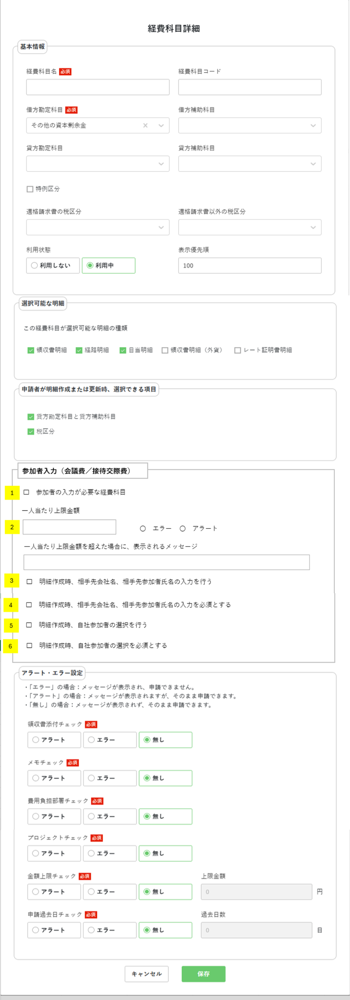

> ⚠️ **File này được auto-generate — KHÔNG sửa tay.**
>
> - Câu trả lời PO/BA → ghi vào [`clarifications.md`](./clarifications.md).
> - Baseline: [`current_state/current_analysis.md`](./current_state/current_analysis.md).
> - Diff chi tiết: [`diff_with_current.md`](./diff_with_current.md).
> - Marker: 🆕 NEW / ✏️ MODIFIED / ↔️ UNCHANGED.

# Phân tích Spec — Màn 経費科目 (KeihiKamoku) — EXTEND "参加者入力 / 会議費"

> Sheet `02_Setting detail mục chi phí` bổ sung **1 nhóm setting mới "参加者入力（会議費／接待交際費）"** vào modal 経費科目詳細.
> Mục tiêu: cho phép cấu hình mục chi phí kiểu **会議費 (chi phí cuộc họp) / 接待交際費 (chi phí tiếp khách)** — yêu cầu nhập **người tham gia (参加者)**, giới hạn **số tiền/người (一人当たり上限金額)**, và bật/bắt buộc các field người tham gia phía đối tác / nội bộ.

---

## 1. Tổng quan màn hình

Spec chỉ EXTEND **1 màn** (master setting), nhưng kích hoạt behaviour ở nhiều màn khác (xem [`diff_with_current.md` §9](./diff_with_current.md)).

| # | Tên màn | Mục đích | Marker |
|---|---|---|---|
| 1 | 経費科目詳細 (modal create/edit) | Thêm section "参加者入力" để cấu hình mục chi phí có người tham gia | ✏️ MODIFIED (thêm section) |

**Bối cảnh sử dụng**:
- Admin/経理 cấu hình 1 mục chi phí (vd "会議費", "接待交際費") → bật cờ "参加者の入力が必要な経費科目".
- Khi申請者 tạo 明細 với mục chi phí này → màn tạo meisai sẽ hiển thị UI nhập người tham gia + check số tiền/người (cross-screen).

---

## 2. Danh sách field / component

### 2.1 Màn hình List
↔️ UNCHANGED — Spec sheet 02 KHÔNG đề cập thay đổi màn list 経費科目一覧.
(Lưu ý: sheet `06_màn ảnh hưởng` R37-R39 có note "keihikomoku: table list hiển thị / điều kiện search / import-download csv" — chưa rõ scope, đưa vào câu hỏi 6.7.)

### 2.2 Màn hình Detail (modal 経費科目詳細) — Section MỚI "参加者入力（会議費／接待交際費）"

| # | Field (JP) | Physical column | Kiểu UI | Required | Default | Rule | Marker |
|---|---|---|---|---|---|---|---|
| 1 | 参加者の入力が必要な経費科目 | `sankasha_nyuryoku_hitsuyo_flag` | Checkbox | — | 0 | **Master toggle**. Khi check (=1) → enable field #2,#3,#4 | 🆕 NEW |
| 2 | 一人当たり上限金額 | `hitori_atari_jogen_kingaku` | Number input | N (cho trống = không limit) | null | Số tiền tối đa/người. Vd 会議費=10,000円. ⚠️ maxlength spec=5 vs DB numeric(11) → Q6.1 | 🆕 NEW |
| 3 | 一人当たり上限金額超過時の種別 | `hitori_atari_jogen_check_kubun` | Radio: エラー/アラート | — | 0 | 0:無し,1:エラー,2:アラート. UI chỉ show エラー/アラート (giống setting Alert/Error của 明細) | 🆕 NEW |
| 4 | 超過時メッセージ | `hitori_atari_jogen_message` | Textarea | N | null | Message hiển thị khi vượt limit. Có thể để trống | 🆕 NEW |
| 5 | 明細作成時、相手先会社名・相手先参加者氏名の入力を行う | `tasha_sankasha_nyuryoku_flag` | Checkbox | — | 0 | Bật hiển thị 2 field đối tác trên màn tạo meisai | 🆕 NEW |
| 6 | 明細作成時、相手先会社名・相手先参加者氏名の入力を必須とする | `tasha_sankasha_hissu_flag` | Checkbox | — | 0 | Bắt buộc nhập 2 field đối tác. Phụ thuộc #5 (Q6.4) | 🆕 NEW |
| 7 | 明細作成時、自社参加者の選択を行う | `jisha_sankasha_sentaku_flag` | Checkbox | — | 0 | Bật hiển thị chọn nhân viên nội bộ trên màn tạo meisai | 🆕 NEW |
| 8 | 明細作成時、自社参加者の選択を必須とする | `jisha_sankasha_hissu_flag` | Checkbox | — | 0 | Bắt buộc chọn nhân viên nội bộ. Phụ thuộc #7 (Q6.4) | 🆕 NEW |

**Các field cũ trong modal** (基本情報, 選択可能な明細, 申請者が…選択できる項目, アラート・エラー設定): ↔️ UNCHANGED — vẫn giữ nguyên (xem baseline §8). Section cờ check đổi tiêu đề hiển thị `アクション・カラー設定` → `アラート・エラー設定` (chỉ label UI, Q6.8).

**Action**: `キャンセル` / `保存` ↔️ UNCHANGED.

---

## 3. Mô tả UI từ ảnh

### 3.1 image_A4.png — Modal 経費科目詳細 (full, có section mới)
**Vị trí**: cell `A4`.

Modal đầy đủ gồm (từ trên xuống): **基本情報** → **選択可能な明細** → **申請者が明細作成または更新時、選択できる項目** → **参加者入力（会議費／接待交際費）** [SECTION MỚI] → **アラート・エラー設定** → nút キャンセル/保存.

Section mới "参加者入力（会議費／接待交際費）" (đánh số 1-6 trong ảnh):
1. ☐ 参加者の入力が必要な経費科目
2. `一人当たり上限金額` [input] ○ エラー ○ アラート → `一人当たり上限金額を超えた場合に、表示されるメッセージ` [textarea]
3. ☐ 明細作成時、相手先会社名、相手先参加者氏名の入力を行う
4. ☐ 明細作成時、相手先会社名、相手先参加者氏名の入力を必須とする
5. ☐ 明細作成時、自社参加者の選択を行う
6. ☐ 明細作成時、自社参加者の選択を必須とする

---

## 4. Business logic / rule

### 4.1 Validation (suy ra từ spec — cần confirm)
- `sankasha_nyuryoku_hitsuyo_flag` = master. Khi = 0 → field #2,#3,#4 disable (và nên reset default? Q6.3).
- `hitori_atari_jogen_kingaku`: cho trống (= không limit). Nếu nhập → numeric. maxlength: **spec=5 vs DB=11** (Q6.1).
- `hitori_atari_jogen_check_kubun`: 1=エラー/2=アラート. Khi master ON, có bắt buộc chọn (≠0) + có bắt buộc nhập 金額/message kèm theo không (Q6.2)?
- `hitori_atari_jogen_message`: optional (R81 "có thể để trống").
- `tasha_sankasha_hissu_flag` (#6) chỉ có nghĩa khi `tasha_sankasha_nyuryoku_flag` (#5) = 1 (Q6.4).
- `jisha_sankasha_hissu_flag` (#8) chỉ có nghĩa khi `jisha_sankasha_sentaku_flag` (#7) = 1 (Q6.4).

### 4.2 Phụ thuộc module khác (cross-screen — chi tiết ở diff §9)
- **Màn tạo 明細 / Receipt Detail**: đọc 8 cờ này để render UI người tham gia + check số tiền/người. Ghi vào bảng MỚI `tr_meisai_sankasha` + `hitori_atari_kingaku` lưu thêm trong `tr_meisai_joho`.
- **Màn list meisai / shiwake export / CSV meisai**: bổ sung field người tham gia (参加人数, 一人当たり金額, 他社参加者会社名/氏名, 自社参加者).
- **tm_meisai_template, tm_sankasha_template(_shosai)**: bảng mới/cột mới liên quan template người tham gia.

### 4.3 Quy tắc đặc biệt
- 種別 (check_kubun) dùng chung khái niệm với "Alert/Error setting" của 明細 (R74-R75): "エラー" = không cho申請, "アラート" = cảnh báo nhưng vẫn申請 được.
- Message logic: hệ thống KHÔNG tự đổi mục chi phí; chỉ hiển thị message gợi ý user tự đổi (R86-R87).

### 4.4 Hiển thị
- Section mới đặt giữa "申請者が…選択できる項目" và "アラート・エラー設定".
- Field #2,#3,#4 enable theo checkbox #1.

### 4.5 Action
- `保存`: lưu 8 field mới vào `tm_keihi_kamoku`. ↔️ Endpoint add/update giữ nguyên, chỉ mở rộng payload.

---

## 5. Mapping sang convention dự án

- **Bảng**: `keihi_com.tm_keihi_kamoku` — ALTER TABLE thêm 8 cột (pattern giống changeset Gaika 2025 của ducna1, baseline §9.8).
- **Entity**: `TmKeihiKamoku` — thêm 8 field.
- **DTO**: `KeihiKamokuDto` — thêm 8 field + validation + `@LogOperation`.
- **API model**: `KeihiKamoku` (⚠️ generated legacy 2021, không có trong openapi.yml — Q6.9 về quy trình regenerate).
- **Service**: `KeihiKamokuService.addKeihiKamoku/updateKeihiKamoku` — thêm default + validation cho 8 field (theo pattern `checkJogenKingaku`/`checkKakoNissu`).
- **Endpoint**: ↔️ KHÔNG thêm endpoint mới (POST/PUT /keihi-kamoku đủ).
- **Enum mới (dự kiến)**: `SankashaJogenCheckKubun` (0/1/2 — có thể tái dùng `CheckFlag`), cờ flag dùng `AriNashiUmu`/`CheckFlag`.

---

## 6. Câu hỏi cần làm rõ

> CHỈ liệt kê câu về **thay đổi**. Chi tiết + severity ở [`clarifications.md`](./clarifications.md).

### 6.1 maxlength `一人当たり上限金額` — 5 hay 11? 🔴
Spec R77 ghi `maxlength: 5` (max 99,999) nhưng DB `hitori_atari_jogen_kingaku` = numeric(11). Lấy số nào? Ảnh hưởng cả validation DTO (`@Range`) lẫn schema.

### 6.2 Khi master checkbox ON, các field con có bắt buộc không? 🟡
`hitori_atari_jogen_check_kubun` có buộc ≠ 0 (phải chọn エラー/アラート)? Nếu chọn エラー/アラート thì `hitori_atari_jogen_kingaku` có buộc > 0 (giống pattern `checkJogenKingaku` hiện tại)? `message` optional đúng không?

### 6.3 Reset value khi tắt master checkbox 🟡
Khi `sankasha_nyuryoku_hitsuyo_flag` chuyển 1→0 (hoặc các cờ con tắt), BE có reset 金額/check_kubun/message/4 cờ con về default (0/null) như pattern `checkJogenKingaku` không, hay giữ nguyên giá trị cũ?

### 6.4 Ràng buộc phụ thuộc giữa các cờ 🟡
Checkbox #6 (tasha_hissu) có cho check khi #5 (tasha_nyuryoku) chưa check? Tương tự #8 vs #7. Cần BE validate ràng buộc này hay chỉ FE disable?

### 6.5 Quan hệ với 3 field "出席者登録" đã chết 🔴
Baseline §9.2: `shussekisha_toroku_umu` / `shussekisha_toroku_check` / `jizen_shinsei_bango_check` (出席者登録 — attendee) đang bị ép = 0. Spec mới dùng **cột MỚI** `sankasha_*` (participant). Xác nhận: KHÔNG tái dùng cột cũ, thêm cột mới? 3 field cũ giữ nguyên (dead) hay cleanup?

### 6.6 Guard "đang dùng trong meisai" khi tắt cờ 🟡
Tương tự `E152` hiện tại (tắt cờ 選択可能性 khi đang dùng trong meisai): nếu tắt `sankasha_nyuryoku_hitsuyo_flag` của mục chi phí đang có meisai chứa người tham gia → có chặn không?

### 6.7 Scope màn list 経費科目一覧 🟢
Sheet 06 (R37-39) note "keihikomoku: table list / điều kiện search / import-download csv". Màn list 経費科目一覧 có cần thêm cột/điều kiện search/cột CSV cho 8 field mới không? Hay chỉ modal detail?

### 6.8 Đổi label section cờ check 🟢
Tiêu đề `アクション・カラー設定` (hiện tại) → `アラート・エラー設定` (spec). Chỉ đổi label hiển thị, không đổi logic — đúng không?

### 6.9 Quy trình regenerate API model 🔴
Baseline §9.3: model `KeihiKamoku` generated 2021 từ spec KHÔNG nằm trong `api_interface_generate_tool/specification/openapi.yml`. Thêm 8 field vào request/response: regenerate từ đâu, hay sửa model bằng tay?

---

## 7. Files tham chiếu
- `raw_dump.txt` — dump sheet 02 (39 dòng dữ liệu)
- `current_state/db_tm_keihi_kamoku_dump.txt` — 8 cột mới từ file DB design
- `images/image_A4.png` — modal 経費科目詳細 đầy đủ
- `images_info.json`
- `current_state/current_analysis.md` — baseline (v1.0.0)
- `diff_with_current.md` — phân tích diff + cross-screen
