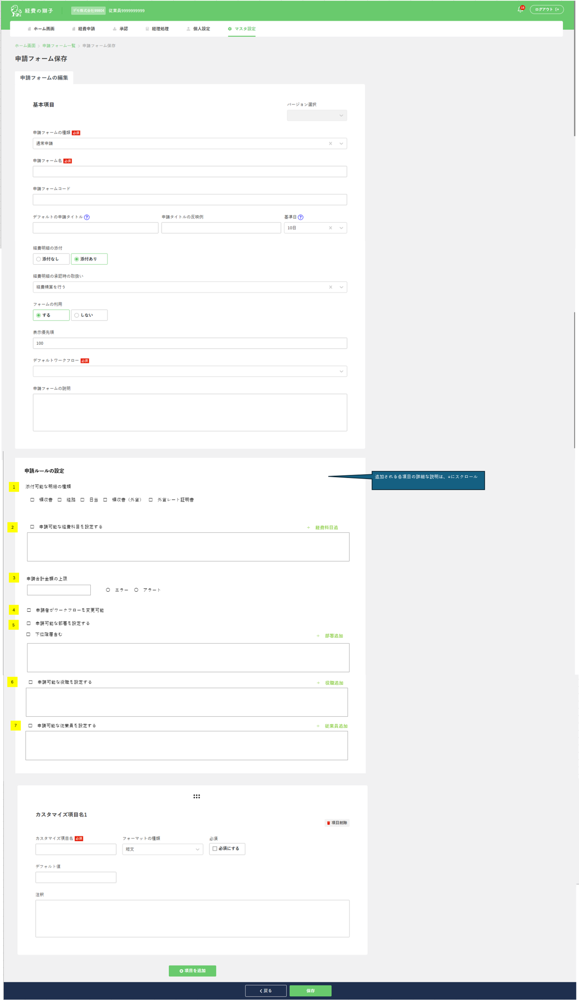

> ⚠️ **File này được auto-generate — KHÔNG sửa tay.**
>
> - Câu trả lời PO/BA → ghi vào [`clarifications.md`](./clarifications.md).
> - Spec gốc update → regenerate, không edit thủ công.
> - File chốt cho dev: `final_spec.md` (sẽ tạo sau khi PO trả lời).
> - (EXTEND) Baseline: [`current_state/current_analysis.md`](./current_state/current_analysis.md).
> - Marker: 🆕 NEW / ✏️ MODIFIED / ↔️ UNCHANGED.

# Phân tích Spec — Màn 申請フォーム詳細設定 (ShinseiForm — Application Rules Setting)

> **Bản chất extend**: Thêm 1 card mới **「申請ルールの設定」** (Application Rules Setting) vào màn 申請フォーム保存, nằm GIỮA card `基本項目` và các card `カスタマイズ項目`. Card này gồm **7 nhóm setting** quy định "luật" áp dụng khi nhân viên dùng form để tạo申請.

---

## 1. Tổng quan màn hình

Breadcrumb: `マスタ設定 > 経費機能設定 > 申請フォーム設定`.

| # | Tên màn | Mục đích |
|---|---|---|
| 1 | 申請フォーム保存 (detail/create/edit) | ↔️ Màn đã có. 🆕 Bổ sung card 「申請ルールの設定」 với 7 nhóm cấu hình luật申請 |

**Bối cảnh sử dụng**:
- Admin (role 5,6) cấu hình form. 7 luật mới quyết định: loại明細 nào được đính kèm, giới hạn経費科目 / 部署 / 役職 / 従業員 nào được dùng form, trần tổng tiền申請, và cho phép người申請 đổi workflow hay không.
- Cross-screen: màn **tạo申請 (shinsei create)** chỉ cho người nộp dùng các form đã lọc theo điều kiện mục 5 (部署), 6 (役職), 7 (従業員).

---

## 2. Danh sách field / component

### 2.1 Màn hình List
↔️ **UNCHANGED** — spec sheet này không đề cập thay đổi màn list. (Giữ nguyên search/table/action hiện tại.)

### 2.2 Màn hình Detail — card mới 「申請ルールの設定」

> Tất cả field dưới đây là 🆕 NEW (thêm vào request/response của API save/get hiện tại — xem mục 5). Cột DB lấy từ `db_tables_..._.xlsx`.

**Nhóm 1 — 添付可能な明細の種類 (Attachable meisai types)** 🆕
| # | Field | Tên gốc | Cột DB | Kiểu UI | Default | Rule |
|---|---|---|---|---|---|---|
| 1.1 | 領収書明細添付可能 | 領収書 | `ryoshusho_meisai_tempu_kanou` | checkbox | 1 (checked) | 0:không / 1:có |
| 1.2 | 経路明細添付可能 | 経路 | `keiro_meisai_tempu_kanou` | checkbox | 1 (checked) | |
| 1.3 | 日当明細添付可能 | 日当 | `nittou_meisai_tempu_kanou` | checkbox | 1 (checked) | |
| 1.4 | 領収書（外貨）明細添付可能 | 領収書（外貨） | `ryoshusho_gaika_meisai_tempu_kanou` | checkbox | 0 | Chỉ hiển thị khi 外貨機能 bật |
| 1.5 | 外貨レート証明書添付可能 | 外貨レート証明書 | `gaika_rate_shomeisho_tempu_kanou` | checkbox | 0 | Hiển thị khi 外貨機能 bật **và** 申請者レート変更可能 |

**Nhóm 2 — 申請可能な経費科目を設定する (Restrict allowed expense items)** 🆕
| # | Field | Cột DB | Kiểu UI | Default | Rule |
|---|---|---|---|---|---|
| 2.1 | 申請可能な経費科目を設定する | `keihi_kamoku_seigen_flag` | checkbox | 0 | 0:không giới hạn / 1:giới hạn theo list |
| 2.2 | Danh sách経費科目 + button「＋経費科目追加」 | child table `tm_shinsei_form_keihi_kamoku` | list + modal | rỗng | Enable chỉ khi 2.1 checked |

**Nhóm 3 — 申請合計金額の上限 (Total amount limit)** 🆕
| # | Field | Cột DB | Kiểu UI | Default | Rule |
|---|---|---|---|---|---|
| 3.1 | 申請合計金額の上限 | `shinsei_gokei_kingaku_jogen` | input số | rỗng (cả data cũ) | length 11, ≥1 (không cho 0), rỗng → bỏ qua check |
| 3.2 | 上限超過時の種別 | `shinsei_gokei_jogen_check_kubun` | radio エラー/アラート | 1 (Error) | 1:Error (chặn申請) / 2:Alert (cảnh báo) |

**Nhóm 4 — 申請者がワークフローを変更可能 (Applicant can change workflow)** 🆕
| # | Field | Cột DB | Kiểu UI | Default | Rule |
|---|---|---|---|---|---|
| 4.1 | 申請者がワークフローを変更可能 | `workflow_henko_kanou_flag` | checkbox | 0 (chưa check) | Chỉ hiển thị khi setting「ワークフロー変更をON,OFFできる」(制限設定) = ON |

**Nhóm 5 — 申請可能な部署を設定する (Restrict allowed departments)** 🆕
| # | Field | Cột DB | Kiểu UI | Default | Rule |
|---|---|---|---|---|---|
| 5.1 | 申請可能な部署を設定する | `busho_seigen_flag` | checkbox | 0 | 0:không giới hạn / 1:giới hạn theo部署 |
| 5.2 | 下位階層を含む | `busho_kai_kaiso_fukumu_flag` | checkbox | 0 | Enable khi 5.1 checked. 1:gồm toàn bộ busho cấp dưới |
| 5.3 | Danh sách部署 + button「＋部署追加」 | child `tm_shinsei_form_busho` | list + modal | rỗng | Enable khi 5.1 checked |

**Nhóm 6 — 申請可能な役職を設定する (Restrict allowed positions)** 🆕
| # | Field | Cột DB | Kiểu UI | Default | Rule |
|---|---|---|---|---|---|
| 6.1 | 申請可能な役職を設定する | `yakushoku_seigen_flag` | checkbox | 0 | |
| 6.2 | Danh sách役職 + button「＋役職追加」 | child `tm_shinsei_form_yakushoku` | list + modal | rỗng | Enable khi 6.1 checked. Search: code, Name |

**Nhóm 7 — 申請可能な従業員を設定する (Restrict allowed employees)** 🆕
| # | Field | Cột DB | Kiểu UI | Default | Rule |
|---|---|---|---|---|---|
| 7.1 | 申請可能な従業員を設定する | `jugyoin_seigen_flag` | checkbox | 0 | |
| 7.2 | Danh sách従業員 + button「＋従業員追加」 | child `tm_shinsei_form_jugyoin` | list + modal | rỗng | Enable khi 7.1 checked |

**Action**: `戻る` (Cancel) / `保存` (Save) — ↔️ giữ nguyên, request mở rộng thêm các field trên.

---

## 3. Mô tả UI từ ảnh

### 3.1 image_A4.png — Screenshot màn 申請フォーム保存 (full, có card mới)
**Vị trí**: cell `A4`.

- Card `基本項目` (↔️ giữ nguyên: 種類/名/コード/申請タイトル/基準日/経費明細の添付/承認時の取扱い/フォームの利用/表示優先順/デフォルトワークフロー/説明).
- 🆕 Card **「申請ルールの設定」** đặt giữa `基本項目` và `カスタマイズ項目名1`, đánh số 1→7 (badge vàng) đúng 7 nhóm ở mục 2.2. Có chú thích "追加される各項目の詳細な説明は、← にスクロール".
- Nhóm 1: 5 checkbox 1 hàng (様収書 / 経路 / 日当 / 領収書(外貨) / 外貨レート証明書).
- Nhóm 2/5/6/7: checkbox + button "＋…追加" góc phải + khung list bên dưới.
- Nhóm 3: input + 2 radio (エラー / アラート).
- Nhóm 4: 1 checkbox.
- Card `カスタマイズ項目` (↔️ giữ nguyên).

---

## 4. Business logic / rule

### 4.1 Validation 🆕
- `shinsei_gokei_kingaku_jogen`: length 11, không cho 0, chỉ ≥1; rỗng → hợp lệ (bỏ qua check khi tạo申請).
- Khi nhóm 2/5/6/7 checkbox = ON mà list rỗng → (TBD: bắt buộc ≥1 item? xem clarifications).
- **Consistency check (A197–A202)**: khi tạo mới / cập nhật form, hệ thống phải kiểm tra 選択可能性 của từng 経費科目 (cấu hình ở màn detail KeihiKamoku — "loại meisai mà経費科目 có thể được chọn") có **khớp** với 添付可能な明細の種類 (nhóm 1) hay không. Không khớp → (TBD: chặn save? error nào?).

### 4.2 Phụ thuộc module khác
- **外貨機能 (foreign currency)**: bật/tắt nhóm 1.4, 1.5 (`shinseishaRateNyuryoku` trong setting Kaisha — note N131; rate off → hiện 3 checkbox, rate on → 5 checkbox; rate on nhưng người nộp không có quyền → 4 checkbox).
- **制限設定 (limit settings)**: setting「ワークフロー変更をON,OFFできる」quyết định hiển thị nhóm 4.
- **経費科目 master** (`tm_keihi_kamoku`): nguồn cho modal nhóm 2; chỉ lấy科目 `使用する` và phù hợp loại meisai đính kèm.
- **部署 / 役職 / 従業員 master**: nguồn modal nhóm 5/6/7.
- Modal nhóm 2/5/6/7 **tái dùng cơ chế modal chọn người approve** của 承認ルート詳細画面 (Detail approve route).

### 4.3 Quy tắc đặc biệt — Cross-screen (màn tạo申請)
- Khi người nộp tạo申請, **chỉ thấy các form đã lọc** theo điều kiện nhóm 5 (部署), 6 (役職), 7 (従業員). (mục A202)
- 下位階層を含む (5.2): ON → tất cả busho cấp dưới đều dùng được form; OFF → chỉ user thuộc đúng busho được chọn.

### 4.4 Hiển thị
- Nhóm 1 hiển thị khi form cho phép đính kèm meisai (`keihiMeisaiTempu = 1`). Khi mở tạo mới → tất cả checkbox hiển thị được mặc định check (theo default DB: 領収書/経路/日当=1; các mục外貨 phụ thuộc điều kiện 4.2).
- Nhóm 2/5/6/7: checkbox OFF → button "追加" + khung list disabled.

### 4.5 Action
- `保存`: lưu form (↔️ vẫn theo cơ chế versioning — INSERT version mới, gọi `addShinseiForm`), kèm 13 field mới + 4 nhóm list con (insert theo (shinsei_form_id, version) mới).

---

## 5. Mapping sang convention dự án

- **Bảng**:
  - ✏️ ALTER `keihi_com.tm_shinsei_form` — thêm 13 cột (mục 2.2 nhóm 1/3/4 + flag nhóm 2/5/6/7).
  - 🆕 Tạo 4 bảng con `keihi_com.tm_shinsei_form_keihi_kamoku`, `tm_shinsei_form_busho`, `tm_shinsei_form_yakushoku`, `tm_shinsei_form_jugyoin` (FK → tm_shinsei_form theo `shinsei_form_id` + version).
- **API pattern**: Hexagonal — tái dùng endpoint hiện tại (POST/PUT `/shinsei-form`, GET `/shinsei-form/{id}`, POST `/shinsei-form/search`). Mở rộng `ShinseiForm` model + `ShinseiFormDto` + entity + adapter + service.
- **Versioning**: 4 bảng con phải versioned theo (shinsei_form_id, shinsei_form_version) — giống `tm_customize_komoku`. Mỗi lần save form INSERT lại list con cho version mới.
- **Endpoint mới (tiềm năng)**: search modal cho経費科目 / 部署 / 役職 / 従業員 (nếu chưa có sẵn) — xem clarifications.
- **Cross-screen**: logic filter form ở màn tạo申請 (`ShinseiJoho` / `viewListShinseiForm`) phải áp điều kiện busho/yakushoku/jugyoin.

---

## 6. Câu hỏi cần làm rõ

> Chi tiết + tracking trong [`clarifications.md`](./clarifications.md). Dưới đây tóm tắt; severity theo `.claude/rules/tbd-severity.md`.

### 6.1 [🔴] Cột version FK của 4 bảng con — `shinsei_form_version` hay `update_version`?
DB sheet ghi cột `update_version` (numeric 4) làm FK + unique key, nhưng BA note ngay trong sheet: *"shinsei_form_version chứ kp update_version"*. `tm_shinsei_form` có PK composite (shinsei_form_id, **shinsei_form_version** BIGINT). Để versioning đúng (giống `tm_customize_komoku`) thì 4 bảng con phải tham chiếu `shinsei_form_version`. → Xác nhận dùng `shinsei_form_version` (BIGINT)?

### 6.2 [🔴] 3 bảng con thiếu cột chuẩn (audit + hyoji_jun)
`tm_shinsei_form_busho / _yakushoku / _jugyoin` trong sheet **thiếu** `hyoji_jun` và 4 audit field (`add_date/upd_date/add_userid/upd_userid`) — BA đã note "Thiếu các cột sau". `tm_shinsei_form_keihi_kamoku` thì có đủ. → Bổ sung audit + hyoji_jun cho cả 3 bảng theo convention dự án?

### 6.3 [🔴] Quan hệ giữa `keihiMeisaiTempu` (hiện có) và nhóm 1 (添付可能な明細の種類 mới)
Hiện `keihiMeisaiTempu` chỉ 0/1 (có/không đính kèm). Nhóm 1 thêm 5 flag chi tiết theo loại meisai. Khi `keihiMeisaiTempu=0` thì 5 flag mới mang giá trị gì (default? bị ẩn nhưng vẫn lưu 0)? Nhóm 1 có thay thế ý nghĩa của `keihiMeisaiTempu` không hay chỉ là sub-detail?

### 6.4 [🟡] Consistency check 経費科目 ↔ 添付可能な明細の種類 (A197–A202)
Khi save form, nếu một 経費科目 đã chọn (nhóm 2) có "loại meisai được chọn" KHÔNG khớp với 添付可能な明細の種類 (nhóm 1) → xử lý ra sao? Chặn save (error) hay chỉ cảnh báo? Message key nào? Phạm vi check chính xác?

### 6.5 [🟡] `shinsei_gokei_kingaku_jogen` — kiểu & đơn vị
"length 11 ký tự", numeric(11). Là số nguyên (yên, không thập phân) tối đa 11 chữ số? Có hỗ trợ ngoại tệ/thập phân không? Khi `上限` rỗng thì `shinsei_gokei_jogen_check_kubun` lưu gì (vẫn default 1)?

### 6.6 [🟡] Nguồn setting điều kiện hiển thị nhóm 1 & nhóm 4
- 外貨機能 / 申請者レート変更可能 (`shinseishaRateNyuryoku`): nằm ở bảng/flag nào trong setting Kaisha? (note N131)
- 「ワークフロー変更をON,OFFできる」(制限設定): nằm ở đâu (table/flag) để BE biết có hiển thị nhóm 4 không?

### 6.7 [🟡] Modal search経費科目/部署/役職/従業員 — tái dùng API có sẵn?
Spec yêu cầu modal "giống modal chọn người approve của 承認ルート詳細画面". Có sẵn endpoint search cho từng master (keihi_kamoku/busho/yakushoku/jugyoin) để tái dùng, hay cần tạo endpoint mới cho từng modal?

### 6.8 [🟡] Validate "list rỗng" khi seigen_flag = ON
Khi checkbox giới hạn (nhóm 2/5/6/7) = ON nhưng danh sách rỗng → có bắt buộc chọn ≥1 item không? Error message?

### 6.9 [🟡] Logic lọc form ở màn tạo申請 (cross-screen) — kết hợp điều kiện 5/6/7
Khi nhiều điều kiện (部署/役職/従業員) cùng bật, user được dùng form nếu thỏa **bất kỳ** (OR) hay **tất cả** (AND)? Khi tất cả seigen_flag=0 thì form available cho mọi người (như hiện tại)?

### 6.10 [🟢] Default checkbox nhóm 1 khi tạo mới vs khi 外貨機能 tắt
Spec: "tất cả checkbox đều check" khi tạo mới. Nhưng default DB của 2 mục外貨 = 0. Khi 外貨機能 tắt (chỉ hiện 3 checkbox) thì 2 cột外貨 lưu 0 đúng chứ?

### 6.11 [🟢] Anomaly đánh số trong sheet
Cột A của spec đánh "6.0", "7.0" (A178, A188) trong khi mục 1–5 đánh số trơn. Chỉ là format, xác nhận không có ý nghĩa nghiệp vụ.

---

## 7. Files tham chiếu
- `raw_dump.txt` — text gốc sheet `01_Setting detail shinsei form`
- `images_info.json` — mapping ảnh
- `images/image_A4.png` — screenshot màn có card mới
- DB: `db_tables_application_rules_meeting_expenses.xlsx` (5 sheet shinsei_form)
- Baseline: `current_state/current_analysis.md` (v1.0.0)
- Diff chi tiết: `diff_with_current.md`
</content>
