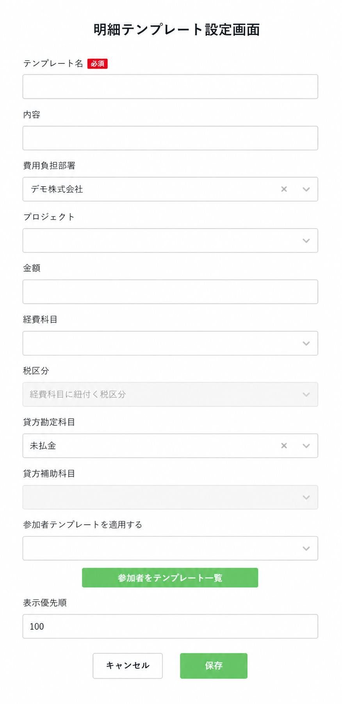
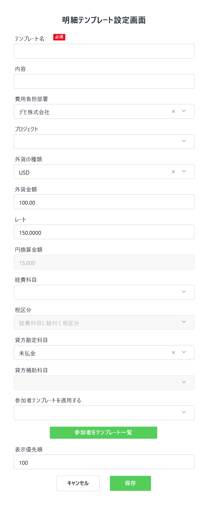
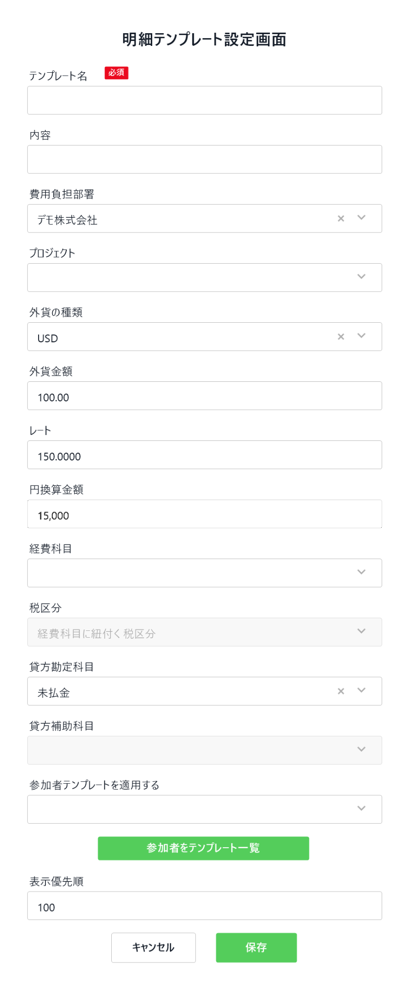
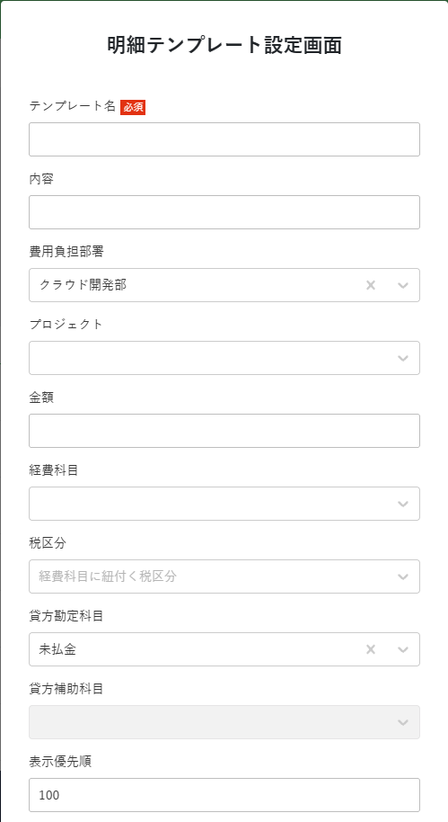

> 📘 **Đây là file spec chốt để implement — cho phase EXTEND màn `明細テンプレート`.**
> - Đây là màn **ĐÃ CÓ SẴN**. File này CHỈ mô tả phần **THÊM / ĐỔI / ẢNH HƯỞNG**.
> - Baseline behaviour (cái đang chạy): xem [`current_state/current_analysis.md`](./current_state/current_analysis.md). KHÔNG lặp lại ở đây.
> - Ký hiệu: 🆕 NEW (chưa có) · ✏️ MODIFIED (đã có, đổi behaviour) · ↔️ UNCHANGED (giữ nguyên, note ngắn).
> - Điểm còn ⚠️ **TBD**: có giá trị tạm để code, cần revisit — xem §7.

# Final Spec — Template Meisai (mở rộng) (明細テンプレート設定画面)

## 1. Tổng quan

Mở rộng màn `明細テンプレート` (đã có) trong `個人設定`, bổ sung **hỗ trợ ngoại tệ** và **áp dụng template người tham gia**. KHÔNG tạo màn mới, KHÔNG đổi flow cốt lõi.

**Scope thay đổi (so với baseline)**:
- 🆕 Thêm 2 mode template: `領収書（外貨）` (`torokuHoho=5`) và `外貨レート証明書` (`torokuHoho=6`).
- 🆕 Thêm 4 cột DB: `gaika_shurui_id`, `rate`, `en_kansan_kingaku`, `sankasha_template_id`.
- 🆕 Thêm control `参加者テンプレートを適用する` (pulldown) + button điều hướng, ở modal `領収書`/`領収書(外貨)`.
- ✏️ List: 2 tab → **4 tab** khi công ty bật ngoại tệ (`TmKaisha.gaikaRiyoUmu = 1`).
- ✏️ `torokuHoho` regex `1|2|4` → `1|2|4|5|6`; đổi ngữ nghĩa `kingaku` theo mode.
- ✏️ Guard service: chặn CRUD mode 5/6 khi ngoại tệ tắt.

| # | Tên màn | Mô tả |
|---|---|---|
| 1 | 明細テンプレート一覧 | List + filter theo mode (thêm 2 tab ngoại tệ) |
| 2 | 明細テンプレート設定画面 | Modal create/update — 4 biến thể theo mode (1/5/6 + giữ 2/4) |

**Bối cảnh sử dụng**: phụ thuộc chức năng ngoại tệ (`GaikaShurui` — `TableCode.TM057`, đã có) và chức năng người tham gia (`tm_sankasha_template`, implement tuần trước).

---

## 2. Màn hình List — 明細テンプレート一覧

> ↔️ **Cột table, paging, sort, button 新規登録/編集/削除/選択したデータを削除 giữ nguyên** theo [current_analysis §8](./current_state/current_analysis.md). Chỉ mô tả phần đổi dưới đây.

### 2.1 ✏️ Tab filter theo mode

Hiện có 2 tab (`領収書登録用`, `経路登録用`). Khi `TmKaisha.gaikaRiyoUmu = 1` (利用する) → hiển thị **4 tab**:

| Tab | Nhãn | `torokuHohos` filter | Điều kiện hiển thị |
|---|---|---|---|
| 1 | 領収書登録用 | `[1]` | Luôn (↔️ giữ) |
| 2 | 経路登録用 | `[2, 4]` | Luôn (↔️ giữ) |
| 3 | 🆕 領収書（外貨）明細登録用 | `[5]` | Chỉ khi `gaikaRiyoUmu = 1` |
| 4 | 🆕 外貨レート証明書登録用 | `[6]` | Chỉ khi `gaikaRiyoUmu = 1` |

> Filter `torokuHohos` truyền vào API `search` đã hỗ trợ list (current). Chỉ cần nới regex validation (xem §4.1).

### 2.2 ✏️ Hiển thị cột 金額 theo mode
- Mode `1`, `6`: `kingaku` = số tiền **yên**.
- Mode `5`: `kingaku` = số tiền **ngoại tệ**; số yên ở `enKansanKingaku`.
- BE trả raw `kingaku` + `gaikaShuruiId` (+ tên loại ngoại tệ nếu cần). **FE tự format** hiển thị/ký hiệu tiền tệ (⚠️ TBD-4, Low).

---

## 3. Màn hình Detail — 明細テンプレート設定画面

Modal `明細テンプレート設定画面` có **4 biến thể** theo `torokuHoho`. Bảng dưới CHỈ liệt kê field 🆕/✏️; field ↔️ giữ nguyên như current modal 領収書 (テンプレート名, 内容, 費用負担部署, プロジェクト, 経費科目, 税区分, 貸方勘定科目, 貸方補助科目, 表示優先順, 金額).

### 3.1 🆕 Field mới

| # | Label (JP) | Tiếng Việt | Kiểu UI | DB column | Required | Hiển thị ở mode |
|---|---|---|---|---|---|---|
| N1 | 外貨の種類 | Loại ngoại tệ | Pulldown (master GaikaShurui theo hojinCode) | `gaika_shurui_id` | ✓ (mode 5) | **5** |
| N2 | 外貨金額 | Số tiền ngoại tệ | Number (2 chữ số TP) | `kingaku` (tái dùng) | ✓ (mode 5) | **5** |
| N3 | レート | Tỷ giá | Number (4 chữ số TP) | `rate` | ✓ (mode 5) | **5** |
| N4 | 円換算金額 | Số tiền quy đổi (yên) | Number, **read-only** (FE tự tính) | `en_kansan_kingaku` | ✓ (mode 5) | **5** |
| N5 | 参加者テンプレートを適用する | Áp dụng template người tham gia | Pulldown (master SankashaTemplate) | `sankasha_template_id` | ✗ | **1, 5** |
| N6 | 参加者をテンプレート一覧 | (button điều hướng) | Button | — | — | **1, 5** |

**Vị trí**:
- N5 + N6: dưới `貸方補助科目`, trên `表示優先順` (mockup A41/A101).
- N1–N4: giữa `プロジェクト` và `経費科目`, thứ tự 外貨の種類 → 外貨金額 → レート → 円換算金額 (mockup A101/A102).

### 3.2 Biến thể theo mode

| Mode | torokuHoho | Field ngoại tệ (N1–N4) | 参加者テンプレート (N5/N6) | 金額 (kingaku) | enKansanKingaku | Mockup |
|---|---|---|---|---|---|---|
| 領収書 | `1` | ❌ Không | ✅ Có | yên | NULL | A41 |
| 領収書（外貨） | `5` | ✅ Có | ✅ Có | ngoại tệ | yên (= kingaku×rate) | A101/A102 |
| 外貨レート証明書 | `6` | ❌ Không | ❌ Không | yên | NULL | A168 |
| 経路 / 経路API | `2`/`4` | ❌ Không | ❌ Không (↔️) | — | NULL | (current) |

> 外貨レート証明書 (6) về **dữ liệu giống 領収書 (1)** — chỉ khác mục đích/hiển thị (clarification 6.8). Không ghi field ngoại tệ.

### 3.3 Action buttons
- `参加者をテンプレート一覧` 🆕: điều hướng FE sang màn danh sách mẫu người tham gia (để tạo mẫu mới). **BE không xử lý** — không có endpoint mới.
- `保存` / `キャンセル`: ↔️ giữ nguyên flow current (kèm validation mới ở §4.1).

### 3.4 Layout reference
- 
-  · 
- 

---

## 4. Business Rules

### 4.1 ✏️ Validation rules
- `torokuHoho`: regex `@EnumNamePattern` đổi `1|2|4` → **`1|2|4|5|6`** (giá trị enum đã có sẵn trong
  `enums/TorokuHoho.java`: `RECEIPT_GAIKA("5")`, `GAIKA_RATE_SHOMEISHO("6")`).
- `MeisaiTemplateSearchParamDto.torokuHohos`: mỗi phần tử regex đổi `1|2|4|` → **`1|2|4|5|6|`**.
- 🆕 Field ngoại tệ — **lấy validation giống `MeisaiJohoDto`** (clarification 6.4):
  - `gaikaShuruiId`: `@Size(max=29)` + `@Pattern(REGEX_ALPHANUMBERIC_ALLOW_BLANK)`.
  - `kingaku`, `enKansanKingaku`: `BigDecimal` (`@NotNull` áp theo group mode 5 — xem dưới).
  - `rate`: `BigDecimal` (ở `MeisaiJohoDto` không có `@Digits` — precision do FE/DB, xem TBD-1).
  - `gaikaShurui` (tên hiển thị, read-only): enrich qua `TableCode.TM057`, `displayAsNameOf="gaikaShurui"`.
- 🆕 **Validation group theo mode** (đề xuất thêm `GroupGaika` cho `torokuHoho=5`):
  - `torokuHoho = 5`: `gaikaShuruiId`, `kingaku`(外貨金額), `rate`, `enKansanKingaku` đều **REQUIRED**.
  - `torokuHoho ∈ {1, 2, 4, 6}`: 4 field ngoại tệ **PHẢI NULL** (BE bỏ qua/không lưu; nếu nhận giá trị → reject hoặc clear, xem TBD-1).

### 4.2 🆕 Field visibility & setting check (ngoại tệ)
- 2 mode (5, 6) + 4 field ngoại tệ chỉ hiển thị khi `TmKaisha.gaikaRiyoUmu = 1` (`Integer`; `0:利用しない, 1:利用する`).
- **BẮT BUỘC guard ở service**: khi `add`/`update`/`deleteList` với record `torokuHoho ∈ {5, 6}` mà công ty có
  `gaikaRiyoUmu != 1` → throw `BadRequestException` (hoặc `ForbiddenException`). Áp cho cả delete record mode 5/6.

### 4.3 ✏️ Ngữ nghĩa `kingaku` theo mode (BREAKING SEMANTIC — clarification 6.5)

| torokuHoho | `kingaku` | `enKansanKingaku` |
|---|---|---|
| `1`, `6` | số tiền **yên** | **NULL** |
| `5` | số tiền **ngoại tệ** | số tiền **yên** đã quy đổi |
| `2`, `4` | (theo current — keiro) | NULL |

- **BE KHÔNG tự tính** `enKansanKingaku`. FE tự tính (`kingaku × rate`, FE tự làm tròn) và gửi lên (clarification 6.3). BE chỉ lưu giá trị nhận được.

### 4.4 🆕 Save strategy cho `sankasha_template_id`
- Lưu **reference only** (chỉ `sankashaTemplateId`, KHÔNG snapshot danh sách người tham gia) — clarification 6.6.
- Chỉ set/áp dụng khi `torokuHoho ∈ {1, 5}`; mode `{2, 4, 6}` → luôn NULL (clarification 6.7).
- **Cascade khi xóa sankasha_template** (clarification 6.6): khi 1 `tm_sankasha_template` bị soft-delete →
  tất cả `tm_meisai_template` có `sankasha_template_id` = id đó phải **set `sankasha_template_id = NULL`**
  (KHÔNG xóa meisai template — nó vẫn dùng được như template thường).
  - **Điểm sửa**: `SankashaTemplateService.deleteOne()` (`application/service/SankashaTemplateService.java:383`)
    — sau khi soft-delete sankasha, gọi thêm logic cập nhật meisai template. ⚠️ Xem TBD-3 (chốt đặt logic ở đâu).

### 4.5 ↔️ Delete behavior
- Giữ nguyên: bulk soft delete (`deleteList`), `delete_flag=1` + `update_version`, owner-scoped. Bổ sung guard §4.2 cho mode 5/6.

### 4.6 ↔️ Display & sort
- Giữ nguyên default sort (`hyojiJun` ASC, `meisaiTemplateMei` ASC) và enrich tên master như current. Bổ sung enrich tên `gaikaShurui` cho mode 5 (nếu cần hiển thị).

### 4.7 ↔️ Access control (role-based)
- Giữ nguyên 4 role: `DEPARTMENT_MANAGEMENT`, `SUPER_ADMIN`, `APPROVED`, `REGISTRATION` qua `checkRolesAllow()` (clarification 6.11). KHÔNG đổi.

---

## 5. Database Schema

> **Nguồn**: `db_tables_application_rules_meeting_expenses.xlsx`, sheet `tm_meisai_template`.
> Đây là **ALTER** bảng đã tồn tại — KHÔNG tạo bảng mới, KHÔNG đổi cột cũ.

### 5.1 🆕 Cột thêm vào `keihi_com.tm_meisai_template`

| Column | Data Type | Length | Nullable | Default | Key | Description | Dùng khi |
|---|---|---|---|---|---|---|---|
| `sankasha_template_id` | varchar | 29 | Yes | NULL | — (soft FK → `tm_sankasha_template`) | 参加者テンプレートID | torokuHoho ∈ {1,5} |
| `gaika_shurui_id` | varchar | 29 | Yes | NULL | — (soft FK → GaikaShurui, TM057) | 外貨種類ID | torokuHoho = 5 |
| `en_kansan_kingaku` | numeric | — | Yes | NULL | — | 円換算金額 (số tiền yên quy đổi) | torokuHoho = 5 |
| `rate` | numeric | — | Yes | `1.0` | — | レート (tỷ giá) | torokuHoho = 5 |

> Precision/scale của `rate` (mockup 4 chữ số TP) và `en_kansan_kingaku` (số nguyên yên): file thiết kế ghi
> `numeric` không kèm precision → để **plain NUMERIC** (giống `kingaku` hiện tại + `tr_meisai_joho.rate`). ⚠️ TBD-1.

### 5.2 ↔️ Cột hiện có
Giữ nguyên toàn bộ (PK `meisai_template_id`, `kingaku`, `delete_flag`, `update_version`, audit fields, các field keiro...). Xem [current_analysis §1.2](./current_state/current_analysis.md).

### 5.3 Quan hệ
| From | Field | To | Cardinality | Mục đích |
|---|---|---|---|---|
| `tm_meisai_template` | `sankasha_template_id` | `tm_sankasha_template` | N : 1 | Áp dụng template người tham gia |
| `tm_meisai_template` | `gaika_shurui_id` | GaikaShurui (TM057) | N : 1 | Loại ngoại tệ |

**On-delete**: soft FK (không ràng buộc FK vật lý). Khi sankasha bị xóa → set NULL (§4.4). KHÔNG index mới (giữ pattern bảng hiện tại — current_analysis §1.3).

### 5.4 Skeleton Liquibase (tham khảo — KHÔNG phải file chính thức)

```xml
<changeSet id="20260604_tm_meisai_template_add_gaika_sankasha_columns" author="ducna1">
  <addColumn schemaName="keihi_com" tableName="tm_meisai_template">
    <column name="sankasha_template_id" type="VARCHAR(29)" remarks="参加者テンプレートID">
      <constraints nullable="true"/>
    </column>
    <column name="gaika_shurui_id" type="VARCHAR(29)" remarks="外貨種類ID">
      <constraints nullable="true"/>
    </column>
    <column name="en_kansan_kingaku" type="NUMERIC" remarks="円換算金額">
      <constraints nullable="true"/>
    </column>
    <column name="rate" type="NUMERIC" defaultValueNumeric="1.0" remarks="レート">
      <constraints nullable="true"/>
    </column>
  </addColumn>
  <rollback>
    <dropColumn schemaName="keihi_com" tableName="tm_meisai_template" columnName="sankasha_template_id"/>
    <dropColumn schemaName="keihi_com" tableName="tm_meisai_template" columnName="gaika_shurui_id"/>
    <dropColumn schemaName="keihi_com" tableName="tm_meisai_template" columnName="en_kansan_kingaku"/>
    <dropColumn schemaName="keihi_com" tableName="tm_meisai_template" columnName="rate"/>
  </rollback>
</changeSet>
```
> File Liquibase thật sẽ tạo bằng prompt riêng (đặt tại `liquibase/init/keihi_com/tm_meisai_template.xml`,
> thêm vào cuối — pattern `database.md` §12). Verify precision (TBD-1) trước khi finalize.

---

## 6. API Endpoints (CHỈ phần đổi)

> ↔️ KHÔNG thêm endpoint mới. Mở rộng request/response 6 endpoint hiện có. Backward compatible (field thêm là optional/additive).
> Model `MeisaiTemplate`, `MeisaiTemplateDto`, `MeisaiTemplateSearchParamDto`: thêm 4 field + nới regex `torokuHoho`.

| # | Method | Path | Thay đổi |
|---|---|---|---|
| 1 | POST | `/meisaiTemplate` (add) | +4 field request; branch mode 5/6; guard `gaikaRiyoUmu`; set NULL field ngoại tệ/sankasha theo mode |
| 2 | PUT | `/meisaiTemplate` (update) | Như add |
| 3 | DELETE | `/meisaiTemplate` (deleteList) | Shape không đổi; +guard `gaikaRiyoUmu` khi record là mode 5/6 |
| 4 | GET | `/meisaiTemplate/{id}` | +4 field response (+ enrich `gaikaShurui` name nếu mode 5) |
| 5 | POST | `/meisaiTemplate/search` | Request: `torokuHohos` chấp nhận 5/6; Response: +4 field |
| 6 | POST | `/meisaiTemplate/view-list` | Response: +4 field |

**Class liên quan (extend, không tạo mới)**: `MeisaiTemplateApiDelegateImpl`, `MeisaiTemplateUseCase`/`...Service`,
`MeisaiTemplateCrud`/`...Adapter`, `TmMeisaiTemplate`, `TmMeisaiTemplateRepository`, `MeisaiTemplateDto`,
`MeisaiTemplateSearchParamDto`, model `MeisaiTemplate`.

**OpenAPI source**: endpoint `MeisaiTemplate` không nằm trong `api_interface_generate_tool/specification/openapi.yml`
đang track (Swagger UI vẫn hiển thị → có thể file openapi khác hoặc model gen tay). Xác định khi implement; nếu không
thấy thì cập nhật trực tiếp model đã gen (clarification 6.12a). ⚠️ TBD-2.

---

## 7. Open Issues / TBD

| # | Điểm TBD | Assumption tạm | Severity | Câu hỏi gốc | Cần xử lý trước |
|---|---|---|---|---|---|
| 1 | Precision/scale `rate` & `en_kansan_kingaku` | Plain `NUMERIC` (giống `kingaku` + `tr_meisai_joho.rate`); FE handle TP (rate=4, 外貨金額=2). BE không đặt `@Digits` (theo `MeisaiJohoDto`) | Medium | 6.4 | Trước khi finalize Liquibase |
| 2 | File OpenAPI spec để extend chưa rõ | Tìm khi implement; nếu không có → sửa model đã gen tay | Medium | 6.12a | Trước khi sửa API contract |
| 3 | Nơi đặt logic cascade set-null khi xóa sankasha_template | Sửa `SankashaTemplateService.deleteOne()` (:383) gọi cập nhật `tm_meisai_template` (set NULL `sankasha_template_id` theo `sankashaTemplateId`) — cần thêm method ở `MeisaiTemplateCrud`/repository (`UPDATE ... SET sankasha_template_id=NULL WHERE sankasha_template_id=?`) | Medium | 6.6 | Trong sprint (trước UAT) |
| 4 | Hiển thị cột 金額 ở list khi mode 5 (yên hay ngoại tệ + ký hiệu) | BE trả raw `kingaku` + `gaikaShuruiId`; FE tự format | Low | 6.5 | Trước UAT |

**Không có TBD High** → `status: ready-for-implementation`.
TBD-3 mang tính cross-screen (đụng `SankashaTemplateService`) — nên chốt cách đặt logic trước khi code phần delete.

**Severity legend**: High = sai → sửa schema/contract (block code) · Medium = sửa vài giờ · Low = chỉ chỉnh constant/config/format.

---

## 8. References

- Baseline current state: [`current_state/current_analysis.md`](./current_state/current_analysis.md) (v1.0.0)
- Spec analysis: [`spec_analysis.md`](./spec_analysis.md) (v1.0.0)
- Clarifications: [`clarifications.md`](./clarifications.md) (v1.0.0 — 12/12 🟢)
- Diff: [`diff_with_current.md`](./diff_with_current.md)
- DB design: `db_tables_application_rules_meeting_expenses.xlsx`, sheet `tm_meisai_template`
- Màn liên quan (relation N:1 mới): [`screen_detail_template_nguoi_tham_gia/final_spec.md`](../screen_detail_template_nguoi_tham_gia/final_spec.md)
- Source tham chiếu validation ngoại tệ: `application/domain/MeisaiJohoDto.java` (`gaikaShuruiId`/`rate`/`kingaku`/`enKansanKingaku`)
- Source enum mode: `application/enums/TorokuHoho.java` (`RECEIPT_GAIKA="5"`, `GAIKA_RATE_SHOMEISHO="6"`)
- Source setting ngoại tệ: `TmKaisha.gaikaRiyoUmu` · GaikaShurui master: `TableCode.TM057`
- Source cascade: `application/service/SankashaTemplateService.java` (method `deleteOne`, :383)
- Convention: `.claude/rules/api-conventions.md`, `.claude/rules/database.md`
- Mockup: `images/image_A41.png`, `image_A101.png`, `image_A102.png`, `image_A168.png`, `image_A2.png`

---

## Version History

### [1.0.0] - 2026-06-04

- Initial final spec cho phase EXTEND màn template-meisai.
- Dựa trên `current_analysis.md` (baseline) + `spec_analysis.md` v1.0.0 + `clarifications.md` v1.0.0 (12/12 answered).
- Scope: thêm 2 mode `torokuHoho` (5, 6), 4 cột DB mới, 4 tab filter list, setting check `gaikaRiyoUmu`,
  cascade set-null `sankasha_template_id`.
- 4 TBD (0 High, 3 Medium, 1 Low).
- Status: `ready-for-implementation` (nên chốt TBD-3 cascade trước khi code phần delete sankasha).
