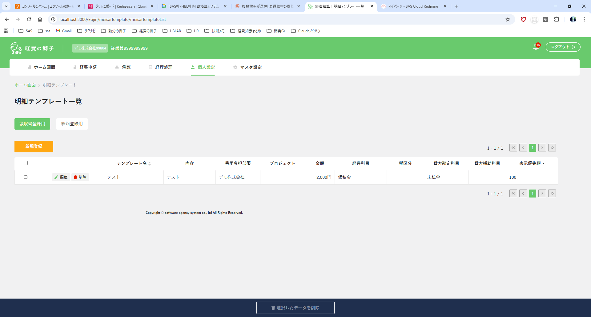

> ⚠️ **File này được auto-generate từ sheet spec — KHÔNG sửa tay.**
> Đây là màn **EXTEND**. Mọi field/rule đều được **cross-check** với
> [`current_state/current_analysis.md`](./current_state/current_analysis.md) — chi tiết diff ở
> [`diff_with_current.md`](./diff_with_current.md).

# Phân tích Spec — Template Meisai (mở rộng) (明細テンプレート設定画面)

---

## 1. Tổng quan màn hình

Sheet `05_Template chức năng mở rộng` **bổ sung** vào màn `明細テンプレート` (đã có sẵn) 2 nhóm tính năng:
1. **Áp dụng template người tham gia** (参加者テンプレート) vào template meisai.
2. **Hỗ trợ ngoại tệ (外貨)** cho template hóa đơn: 2 loại template mới + 4 field ngoại tệ.

| # | Tên màn / phần | Mục đích |
|---|---|---|
| 1 | 明細テンプレート一覧 (list) | Bổ sung 2 button/mode mới khi bật chức năng ngoại tệ |
| 2 | 明細テンプレート設定画面 (modal — 領収書) | Bổ sung pulldown chọn 参加者テンプレート |
| 3 | 明細テンプレート設定画面 (modal — 領収書 ngoại tệ) | Thêm 4 field ngoại tệ + 参加者テンプレート |
| 4 | 明細テンプレート設定画面 (modal — 外貨レート証明書) | Loại template chứng minh tỷ giá, KHÔNG có 参加者テンプレート |

**Bối cảnh sử dụng**:
- Phụ thuộc **chức năng người tham gia** (`tm_sankasha_template` — đã implement tuần trước).
- Phụ thuộc **chức năng ngoại tệ** (đã có sẵn: `GaikaShuruiService`, `TrMeisaiJoho` đã có `gaikaShuruiId`/`rate`/`enKansanKingaku`).
- ⚠️ **Lưu ý scope**: trong cùng file xlsx còn 2 sheet liên quan trực tiếp màn này — `07_Bổ sung màn hình list meisai` và `08_Bổ sung modal`. Phân tích này CHỈ cover sheet `05`. Cần đọc thêm 07/08 để có bức tranh đầy đủ (xem mục 6.x).

---

## 2. Danh sách field / component

### 2.1 Màn hình List (明細テンプレート一覧) — phần bổ sung

**Action buttons (mode filter)** — hiện tại có 2: `領収書登録用`, `経路登録用`. Bổ sung:

| # | Button (mode) | Tên gốc | Điều kiện hiển thị | Source |
|---|---|---|---|---|
| B3 | Hóa đơn ngoại tệ | `領収書（外貨）明細登録用` | CHỈ khi chức năng ngoại tệ BẬT (setting công ty) | A98–A100 |
| B4 | Chứng minh tỷ giá | `外貨レート証明書登録用` | CHỈ khi chức năng ngoại tệ BẬT | A164–A167 |

→ Mỗi button = 1 mode lọc list + mở modal tương ứng. (Cột bảng list giữ nguyên như current — xem mục 8 current_analysis.)

### 2.2 Modal 領収書 (thường) — field bổ sung

| # | Field | Tên gốc | Kiểu UI | Required | Default | Vị trí | Rule |
|---|---|---|---|---|---|---|---|
| F-NEW1 | Áp dụng template người tham gia | `参加者テンプレートを適用する` | Pulldown | No | (trống) | **Dưới `貸方補助科目`, trên `表示優先順`** | Chọn 1 sankasha template để áp dụng |
| — | (button) | `参加者をテンプレート一覧` | Button (xanh) | — | — | Ngay dưới pulldown trên | Điều hướng sang màn danh sách mẫu người tham gia để tạo mới |

> Các field còn lại trong modal (テンプレート名, 内容, 費用負担部署, プロジェクト, 金額, 経費科目, 税区分, 貸方勘定科目, 貸方補助科目, 表示優先順) **giữ nguyên** như current state.

### 2.3 Modal 領収書（外貨） — field bổ sung (ngoài 参加者テンプレート ở 2.2)

| # | Field | Tên gốc | JSON/DB | Kiểu UI | Required | Default | Rule |
|---|---|---|---|---|---|---|---|
| F-NEW2 | Loại ngoại tệ | `外貨の種類` | `gaikaShuruiId` | Pulldown | (TBD) | — | Nguồn từ master ngoại tệ (GaikaShurui) |
| F-NEW3 | Số tiền ngoại tệ | `外貨金額` | `kingaku` (tái dùng) | Number | (TBD) | — | 2 chữ số thập phân (mockup `100.00`) |
| F-NEW4 | Tỷ giá | `レート` | `rate` | Number | (TBD) | `1.0` | 4 chữ số thập phân (mockup `150.0000`) |
| F-NEW5 | Số tiền quy đổi (yên) | `円換算金額` | `enKansanKingaku` | Number (read-only/disabled) | — | auto | **`enKansanKingaku = kingaku × rate`** (S113) |

> Thứ tự field trong modal ngoại tệ (theo mockup A101/A102): テンプレート名 → 内容 → 費用負担部署 → プロジェクト → **外貨の種類 → 外貨金額 → レート → 円換算金額** → 経費科目 → 税区分 → 貸方勘定科目 → 貸方補助科目 → **参加者テンプレートを適用する** + button → 表示優先順.

### 2.4 Modal 外貨レート証明書登録用

- Các field **giống template hóa đơn thường** (A161): テンプレート名, 内容, 費用負担部署, プロジェクト, 金額, 経費科目, 税区分, 貸方勘定科目, 貸方補助科目, 表示優先順.
- **KHÔNG có** 参加者テンプレート (A162). Mockup A168 cũng KHÔNG hiển thị 4 field ngoại tệ — chỉ có `金額` (yên).

---

## 3. Mô tả UI từ ảnh

### 3.1 image_A2.png — screenshot list 明細テンプレート一覧
Màn list hiện hành (1 record demo). Hiển thị 2 tab `領収書登録用`(active)/`経路登録用`, button `新規登録`, bảng + footer `選択したデータを削除`. **Chưa** thấy 2 button mode ngoại tệ ở ảnh này (ảnh baseline).

### 3.2 image_A41.png — wireframe modal 領収書 (có 参加者テンプレート)
Modal `明細テンプレート設定画面`. Xác nhận field mới `参加者テンプレートを適用する` (pulldown) + button xanh `参加者をテンプレート一覧`, đặt **dưới `貸方補助科目`, trên `表示優先順`**.

### 3.3 image_A101.png / image_A102.png — wireframe modal 領収書（外貨）
Modal ngoại tệ đầy đủ: `外貨の種類`(USD), `外貨金額`(100.00), `レート`(150.0000), `円換算金額`(15,000). Ở A101 ô `円換算金額` bị disable/xám (auto-calc); A102 hiển thị giá trị. Có `参加者テンプレートを適用する` + button trước `表示優先順`.

### 3.4 image_A168.png — wireframe modal 外貨レート証明書
Modal chứng minh tỷ giá: chỉ có `金額` (yên), KHÔNG có 4 field ngoại tệ, KHÔNG có 参加者テンプレート.

---

## 4. Business logic / rule rút ra được từ spec

### 4.1 Validation / Rule tính toán
- `円換算金額 (enKansanKingaku) = 外貨金額 (kingaku) × レート (rate)` — field read-only, auto-tính (S113).
- `rate` default `1.0` (giống `tr_meisai_joho.rate`).
- `enKansanKingaku` nullable (giống `kingaku` hiện có) — A4 db sheet.

### 4.2 Phụ thuộc module khác
- **Người tham gia**: `参加者テンプレートを適用する` tham chiếu `tm_sankasha_template` → cột mới `sankasha_template_id`.
- **Ngoại tệ**: tái dùng hạ tầng `GaikaShurui` + field kiểu `gaikaShuruiId/rate/enKansanKingaku` đã có ở `TrMeisaiJoho`.

### 4.3 Quy tắc đặc biệt (điều kiện hiển thị)
- 2 mode `領収書（外貨）` và `外貨レート証明書` **chỉ hiển thị/tạo/sửa/xóa khi chức năng ngoại tệ của công ty được BẬT** (A88, A99, A160, A165).
- 参加者テンプレート áp dụng cho: 領収書 thường + 領収書（外貨）. **KHÔNG** áp dụng cho 外貨レート証明書 (A162) và (theo current) không có ở 経路.

### 4.4 Hiển thị
- 外貨レート証明書 dùng `金額` (yên) — không dùng 4 field ngoại tệ (mockup A168).

### 4.5 Action
- Button `参加者をテンプレート一覧` → điều hướng sang màn danh sách mẫu người tham gia (A78, A83).

---

## 5. Mapping sang convention dự án (tham chiếu nhanh)

- Bảng: `keihi_com.tm_meisai_template` → **ALTER ADD 4 cột** (xem `diff_with_current.md` mục 6).
- API pattern: Hexagonal — **extend** `MeisaiTemplate*` hiện có (không tạo domain mới).
- Endpoint dự kiến: **không thêm endpoint mới**, mở rộng request/response của `add/update/get/search` + thêm giá trị `torokuHoho` mới.
- Liquibase: 1 changeset `addColumn` (4 cột nullable) — pattern `database.md` mục 12.

---

## 6. Câu hỏi cần làm rõ

> Đã LƯỢC BỎ các câu mà `current_analysis.md` đã trả lời. Chỉ giữ câu spec mới **thật sự chưa rõ / mâu thuẫn**.

### 6.1 Giá trị `torokuHoho` cho 2 mode mới (BLOCKER 🔴)
Hiện `toroku_hoho` = `1:領収書, 2:経路, 3:日当, 4:経路API` và validation chỉ nhận `1|2|4`. 2 mode mới `領収書（外貨）` và `外貨レート証明書` sẽ được mã hóa thế nào?
(A) Thêm giá trị mới (vd `5`, `6`) vào `toroku_hoho`; hay
(B) Tái dùng `torokuHoho=1` + 1 cờ phân biệt? — **DB sheet KHÔNG có cột cờ mode mới**, nên nghiêng (A).
→ Ảnh hưởng: validation regex, branch logic add/update, filter list. **Phải chốt trước khi viết changeset/validation.**

### 6.2 Setting bật/tắt chức năng ngoại tệ
Field/setting nào của công ty quyết định bật ngoại tệ (để ẩn/hiện 2 mode + 4 field)? Có sẵn trong `TmKaisha`/`KaishaDto` không, key là gì? BE có cần chặn create/update/delete khi setting tắt không (A88/A160)?

### 6.3 `円換算金額` — ai tính & quy tắc làm tròn
BE tự tính `enKansanKingaku = kingaku × rate` (bỏ qua giá trị FE gửi) hay tin FE? Làm tròn thế nào (round/floor/ceil), bao nhiêu chữ số (mockup hiển thị `15,000` = số nguyên yên)?

### 6.4 Bắt buộc & định dạng các field ngoại tệ
`外貨の種類`, `外貨金額`, `レート` có required khi ở mode ngoại tệ không? Số chữ số thập phân: 外貨金額 = 2 (mockup `100.00`), rate = 4 (mockup `150.0000`) — đúng không? Range hợp lệ của rate?

### 6.5 Ngữ nghĩa `kingaku` ở mode ngoại tệ
Xác nhận: ở mode ngoại tệ, cột `kingaku` lưu **số tiền ngoại tệ** (外貨金額), còn `enKansanKingaku` lưu số tiền yên. Đúng với current (`kingaku` đang là số tiền yên ở 領収書 thường) → đây là **đổi ngữ nghĩa theo mode**, cần confirm để FE/BE thống nhất.

### 6.6 Hành vi "áp dụng 参加者テンプレート"
Khi chọn `参加者テンプレートを適用する`, BE lưu gì vào template meisai? Chỉ lưu `sankasha_template_id` (reference), hay copy snapshot danh sách người tham gia? Khi sankasha template bị xóa thì meisai template xử lý thế nào?

### 6.7 Scope áp dụng 参加者テンプレート
Xác nhận 参加者テンプレート áp dụng cho 領収書 + 領収書（外貨）, KHÔNG cho 外貨レート証明書 (A162) và KHÔNG cho 経路 (đúng current). Có áp dụng cho 経路/経路API không?

### 6.8 Loại `外貨レート証明書` có dùng 4 cột ngoại tệ không?
Mockup A168 chỉ có `金額` (yên), không có field ngoại tệ — nhưng tên loại là "ngoại tệ". Xác nhận loại này **KHÔNG** ghi `gaikaShuruiId/rate/enKansanKingaku` và `kingaku` = số tiền yên?

### 6.9 Nguồn dropdown `外貨の種類`
Dropdown lấy từ master GaikaShurui hiện có (theo công ty)? Lưu `gaikaShuruiId` (VARCHAR 29) — đúng kiểu chứ?

### 6.10 Tabs/filter ở màn list khi bật ngoại tệ
Khi bật ngoại tệ, list có bao nhiêu tab (領収書 / 経路 / 領収書(外貨) / 外貨レート証明書)? Giá trị `torokuHohos` filter tương ứng (liên quan 6.1)?

### 6.11 Role check
Spec không nhắc role. Xác nhận giữ nguyên 4 role hiện tại (DEPARTMENT_MANAGEMENT, SUPER_ADMIN, APPROVED, REGISTRATION)?

### 6.12 OpenAPI spec source & sheet 07/08
(a) Endpoint `MeisaiTemplate` KHÔNG nằm trong `api_interface_generate_tool/specification/openapi.yml` đang track → cần xác định file spec nào để thêm 4 field + giá trị torokuHoho mới.
(b) Sheet `07_Bổ sung màn hình list meisai` và `08_Bổ sung modal` có bổ sung gì cho màn này ngoài sheet 05 không? (cần phân tích tiếp để không sót).

---

## 7. Files tham chiếu
- `raw_dump.txt` — dump cell value sheet 05.
- `images_info.json` — metadata 5 ảnh đã extract.
- `images/image_A2.png` — list baseline.
- `images/image_A41.png` — modal 領収書 (+ 参加者テンプレート).
- `images/image_A101.png`, `images/image_A102.png` — modal 領収書（外貨）.
- `images/image_A168.png` — modal 外貨レート証明書.
- `current_state/current_analysis.md` — baseline current state (v1.0.0).
- `diff_with_current.md` — phân tích diff chi tiết.
- DB design: `db_tables_application_rules_meeting_expenses.xlsx` → sheet `tm_meisai_template` (4 cột mới).
